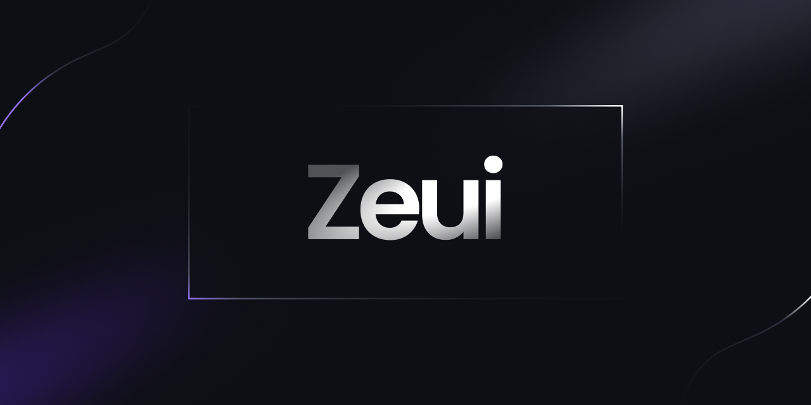

# ZeUI

A free and open-source components for Qwik, built with TailwindCSS.



> This was only built for fun, the api may not be great because, well, I'm not a TypeScript person. Only use it for fun and simple projects.

### Components:

- Button
- Menu
- Modal
- ... and more, soon!

### Important note:

For the icons, I am using [Unplugin Icons](https://github.com/antfu/unplugin-icons) to compile the icons for Qwik. I used [Lucide Icons](https://github.com/lucide-icons/lucide) for the icon library.

If you use Qwik:

npm:

```sh
npm i -D unplugin-icons @iconify-json/lucide @svgx/core
```

yarn:

```sh
yarn add -D unplugin-icons @iconify-json/lucide @svgx/core
```

pnpm:

```sh
pnpm add -D unplugin-icons @iconify-json/lucide @svgx/core
```

then add this to the `plugins[]` option in `vite.config.ts`:

```js
Icons({ compiler: "qwik" });
```

for the type declaration, add this in `tsconfig.json`

```json
{
  "compilerOptions": {
    "types": ["unplugin-icons/types/qwik"]
  }
}
```

### API:

- I will work on making the components' api to give developers a great experience soon. If you want to help me improve the api, it would be very helpful and appreciated. Thanks! :smile:
